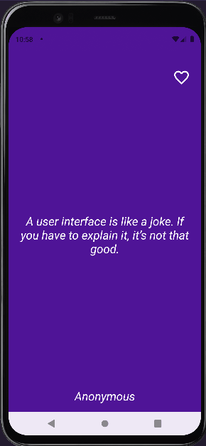

# 📱 App de Citas de Programadores - Ejemplo MVVM en Android

- Este proyecto es una aplicación sencilla que muestra citas relacionadas con la programación. 
- Está desarrollada en **Kotlin** utilizando el patrón de arquitectura **MVVM** (Model - View - ViewModel), principios de **Clean Architecture**, e implementa **inyección de dependencias con Dagger Hilt**. También incorpora una **base de datos local con Room** para persistir las citas y **pruebas unitarias** para verificar la lógica de negocio.
- Ahora incluye un botón para que el usuario pueda guardar sus frases favoritas ❤️.
---
## 👩‍🏫 ¿Qué hace esta app?

- Al abrir la app, muestra una cita inspiradora aleatoria sobre programación.
- Al hacer clic en cualquier parte de la pantalla, se muestra una nueva cita aleatoria.
- Las citas provienen de una base de datos en línea (Firebase Realtime Database).
- Una vez obtenidas, las citas se guardan localmente usando Room para acceder a ellas sin conexión.
- Las citas aleatorias posteriores se cargan desde la base de datos local.
- ✅ **NUEVO:** Puedes marcar tus frases favoritas y la app las recordará.

## 🧠 Arquitectura MVVM + Clean (simplificada)

La app está dividida en capas para mantener el código ordenado, entendible y escalable:

### 🧱 Modelo (Model)
Representa los datos y su origen.

- `QuoteModel.kt`: Modelo de dominio (cita con texto,  autor, favorito).
- `QuoteEntity.kt`: Entidad Room para persistencia local.
- `QuoteProvider.kt`: Contenedor temporal de citas (ya no se usa directamente, pero puede ser útil).

### 🌐 Red (Network)
Encargada de comunicarse con la API.

- `QuoteApiClient.kt`: Define el endpoint para obtener todas las citas desde Firebase usando Retrofit.
- `QuoteService.kt`: Ejecuta la llamada a la API utilizando `RetrofitHelper`.

### 🗄️ Base de datos local (Room)
Permite guardar y recuperar citas localmente.

- `QuoteDao.kt`:   
  - Consultas para obtener, insertar y actualizar citas.
  - Añadido soporte para actualizar el campo `isFavorite`.
- `QuoteDatabase.kt`: Define la base de datos local Room.

### 📦 Repositorio (Repository)
Intermediario entre los datos (API / Room) y la lógica de negocio (Use Cases).

- `QuoteRepository.kt`:
    - Si es necesario, obtiene las citas desde el servicio de red.
    - Las guarda en la base de datos Room.
    - Devuelve citas al ViewModel desde Room. 
    - Agrega lógica para guardar y actualizar citas favoritas.

### 🎯 Casos de Uso (UseCase)
Contienen la lógica del negocio de la app.

- `GetQuotesUseCase.kt`: Obtiene todas las citas desde la API y las guarda localmente.
- `GetRandomQuoteUseCase.kt`: Elige una cita aleatoria desde Room.
- **En desarrollo**: Falta incluir caso de uso para marcar/desmarcar como favorito.

### 👁️ Vista (View)
Se encarga de mostrar los datos al usuario y responder a sus interacciones.

- `MainActivity.kt`: Muestra la interfaz de usuario, observa los cambios del ViewModel y responde al clic del usuario para mostrar una nueva cita.
  - 🆕 **Ahora incluye un botón para marcar una cita como favorita**.
  - 
### 🧠 ViewModel
Conecta la vista con los datos y la lógica de negocio.

- `QuoteViewModel.kt`: 
  - Se comunica con los casos de uso, mantiene el estado de la cita actual y la muestra a la vista usando `LiveData`.
  - Maneja el estado actual de la cita y si es favorita.
  - Expone funciones para cambiar de cita y marcar como favorita.
  
## 🧪 Pruebas Unitarias

Este proyecto incluye pruebas unitarias que validan el comportamiento de los casos de uso principales:

### ✅ `GetQuotesUseCaseTest.kt`

- **Caso 1:** Si la API no retorna citas, se obtienen desde la base local.
- **Caso 2:** Si la API retorna citas, se borran las anteriores, se guardan las nuevas y se retornan.

### ✅ `GetRandomQuoteUseCaseTest.kt`

- **Caso 1:** Si la base de datos está vacía, retorna `null`.
- **Caso 2:** Si la base tiene citas, retorna una aleatoria.

Las pruebas están escritas usando **MockK** y se ejecutan con **coroutines**.

---
## 🧩 Inyección de dependencias con Dagger Hilt

La app utiliza **Dagger Hilt** para gestionar la inyección de dependencias de forma eficiente y desacoplada. Esto permite una mejor escalabilidad y testeo del código.

- `@HiltAndroidApp`: Aplicación base configurada para usar Hilt.
- `@Inject`: Se usa para proveer dependencias en clases como `QuoteViewModel`, `QuoteRepository`, y `QuoteService`.
- `@Module` y `@InstallIn`: Se definen módulos para proveer Retrofit, Room, el cliente de API y otras dependencias.

Gracias a Hilt, las dependencias se inyectan automáticamente en el ViewModel y otras capas del proyecto, reduciendo el boilerplate y facilitando el mantenimiento.

## 📡 Backend utilizado

- **Firebase Realtime Database**: Se utiliza como backend para guardar y obtener las citas en formato JSON.

Ejemplo de URL de la base de datos:  
`https://drawsomething-59328-default-rtdb.europe-west1.firebasedatabase.app/.json`

## 🧰 Tecnologías utilizadas

- **Kotlin**
- **MVVM**
- **Clean Architecture (simplificada)**
- **Room** como base de datos local
- **Dagger Hilt** para inyección de dependencias
- **ViewModel + LiveData**
- **ViewBinding**
- **Coroutines** para llamadas asíncronas
- **Retrofit** para conectarse a la API
- **Firebase Realtime Database** como fuente de datos
- **MockK** para test unitarios

## 📖 ¿Para qué sirve este proyecto?

Este proyecto es un excelente punto de partida para:

- Aprender a implementar el patrón MVVM en Android.
- Comprender el flujo completo de datos desde una API hasta la interfaz.
- Practicar con Retrofit, Firebase, Coroutines y Room.
- Introducirse en Clean Architecture y buenas prácticas.
- Aprender a implementar **inyección de dependencias con Hilt**.
- Familiarizarse con `ViewBinding`, `LiveData`, `ViewModel` y más.
- Practicar pruebas unitarias con casos de uso reales.

## 🛠️ ¿Cómo correr este proyecto?

1. Clona el repositorio.
2. Abre el proyecto en Android Studio.
3. Asegúrate de tener conexión a internet (las citas se cargan desde Firebase).
4. Ejecuta la app en un emulador o dispositivo físico.
5. La primera vez se cargan las citas desde la API. Luego, todo funciona desde la base de datos local.

---

✨ Este proyecto está pensado como material de estudio y base para futuros desarrollos. Puedes expandirlo agregando navegación entre pantallas, guardar citas favoritas, paginación, pruebas unitarias, compartir citas, entre otros.
